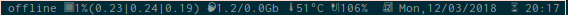

DESCRIPTION
-----------
This is a fork of suckless dwmstatus based on another fork by Wojtek242. It can display wifi info such as SSID, signal strengh, upload and download speed, cpu, ram, swap, temperature, battery, disk usage, date and time. Optionally, I use unicode (UTF-8) characters as symbols for displaying these infos. Screenshots below.

CONFIG
------
It is necessary to alter some configs within dwmstatus.c so it will correctly pick your hardware's info. Check all #define variable. Specially wificard, wiredcard, batt-now, batt-full, etc.

INSTALL
-------
Git clone this repository. `$cd` into it. run the following commands  
```
$make  
$sudo make install
```  
Now, you should have a working bin.

SCREENSHOTS
-----------
Connected via wifi  


Connected via ethernet  


Offline  

